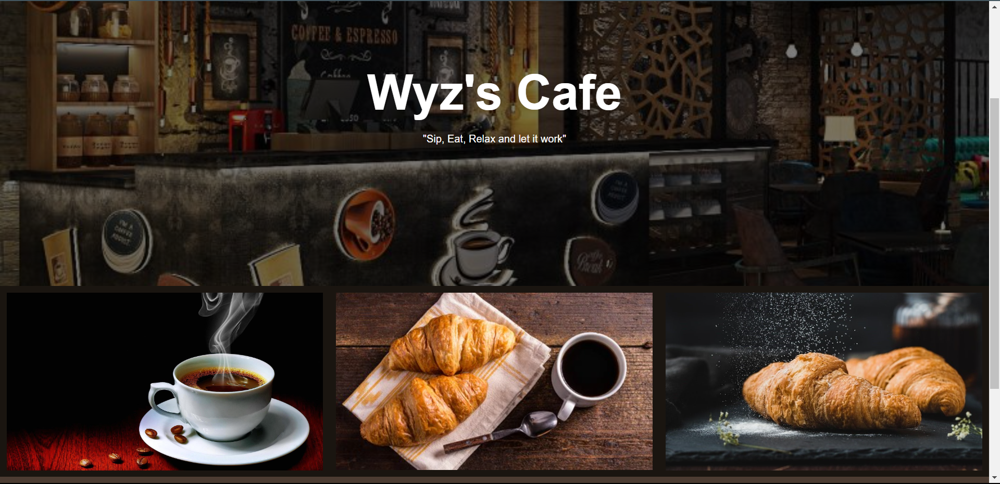
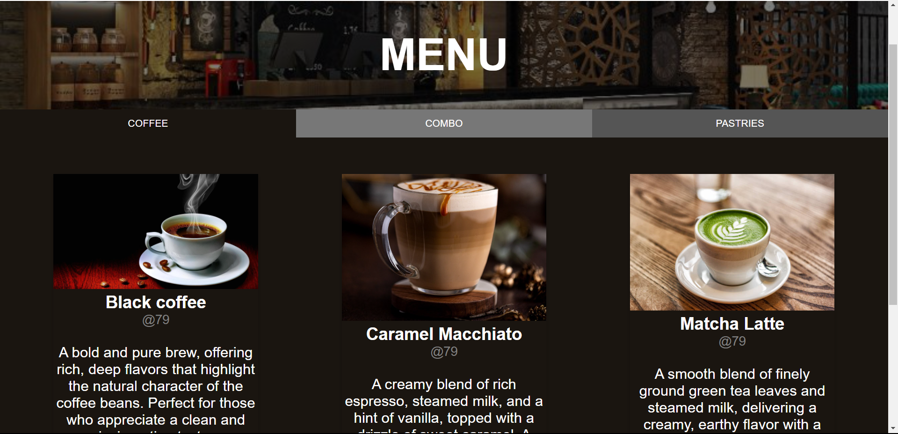
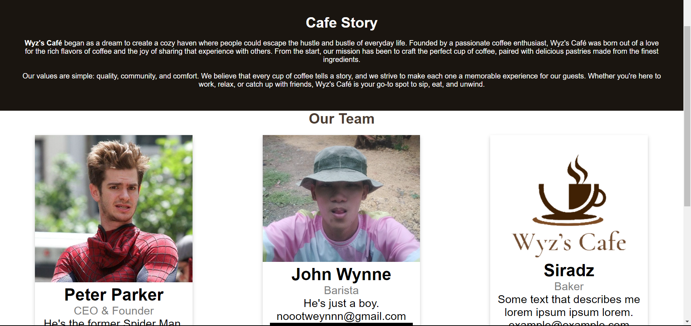
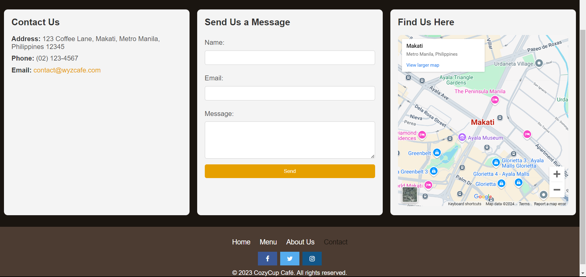

# Wyz's Café

## Project Description
Wyz's Café is a website for a cozy coffee and pastries café located in the Philippines. The website provides information about the café's story, menu, team, and mission, and offers a user-friendly interface for visitors to explore the unique ambiance and offerings of Wyz's Café.

## Features
- **Café Story**: Learn about the history and values of Wyz's Café.
- **Meet the Team**: Get to know the people behind the café with photos and short bios.
- **Menu**: Explore a variety of coffee and pastry options.
- **Contact**: Easy access to contact information and location.
- **Navigation Links**: Simple navigation for a better user experience.

## Screen Captures

*The welcoming homepage of Wyz's Café, showcasing the café's tagline and inviting atmosphere.*

*The menu page displays the variety of coffee and pastries available at Wyz's Café.*

*Learn more about the history and values of Wyz's Café on the About Us page.*

*Easy access to contact details, location, and social media links on the Contact page.*

## About the Authors

**Name:** Siradz M. Sahiddin
**Email:** 202280411@psu.palawan.edu.ph

  

